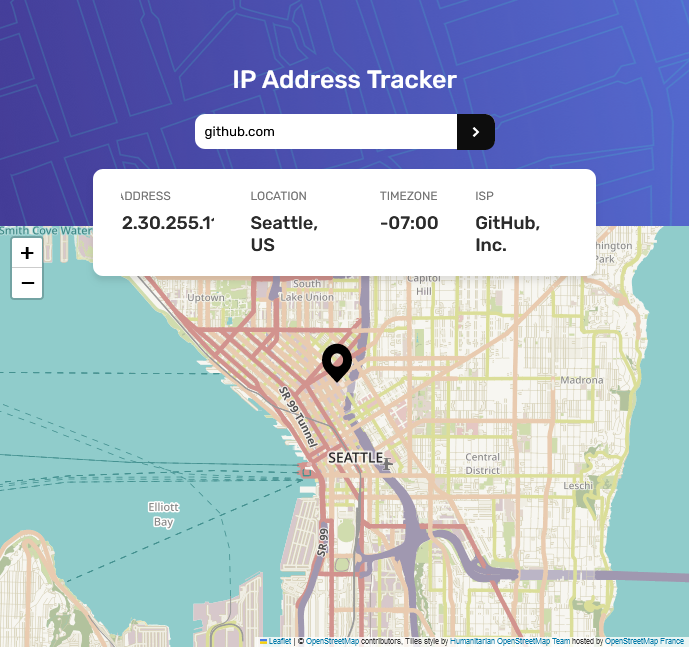

# Frontend Mentor - IP address tracker solution

This is a solution to the [IP address tracker challenge on Frontend Mentor](https://www.frontendmentor.io/challenges/ip-address-tracker-I8-0yYAH0).

## Overview

### The challenge

The goal of this project was to create a responsive IP address tracker application with the following features:

- Display an optimal layout for various screen sizes
- Implement hover states for interactive elements
- Show the user's IP address on the map during the initial page load
- Allow users to search for any IP addresses or domains, providing key information and location details

### Screenshot

### Built with

The solution is crafted using the following technologies:

- Semantic HTML5 Markup
- CSS Custom Properties
- Flexbox for layout
- Mobile-First Workflow for responsiveness
- [LeafletJS](https://leafletjs.com/) - A leading library for interactive maps
- [IP Geolocation API by IPify](https://geo.ipify.org/) - Utilized for retrieving IP address locations
- [React](https://reactjs.org/)
- [Vite](https://vitejs.dev/)

### Useful Resources

- [Leaflet Maps in React](https://mugan86.medium.com/mapas-leaflet-en-react-503deaffb10d) - A helpful resource for understanding how to work with Leaflet in a React environment.

Feel free to explore the code and adapt it for your own projects! If you have any suggestions or improvements, please don't hesitate to open an issue or submit a pull request.
